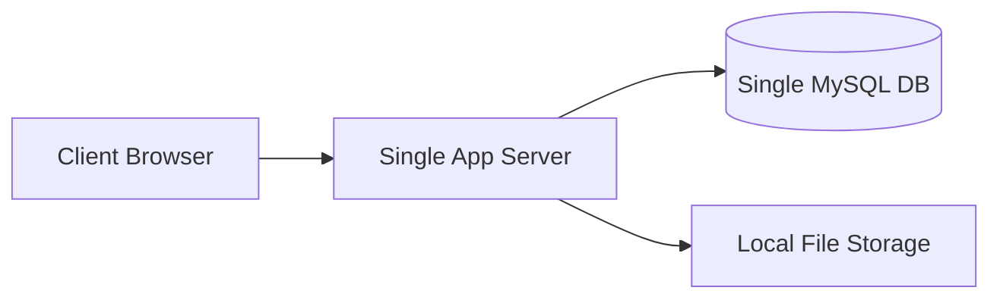
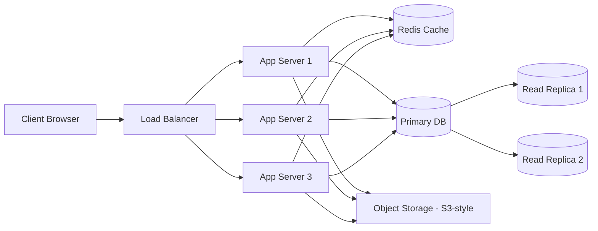
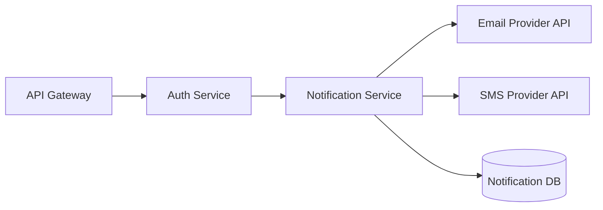
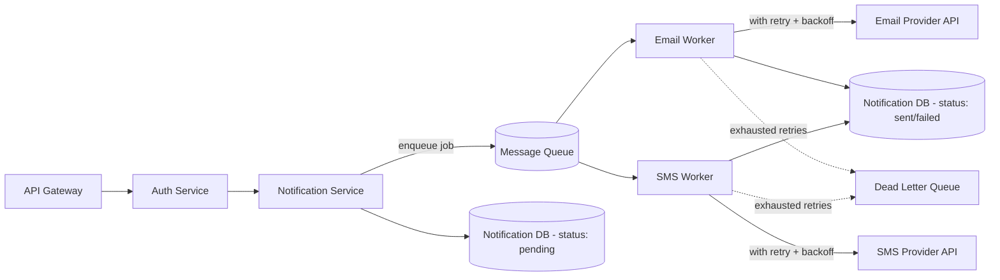
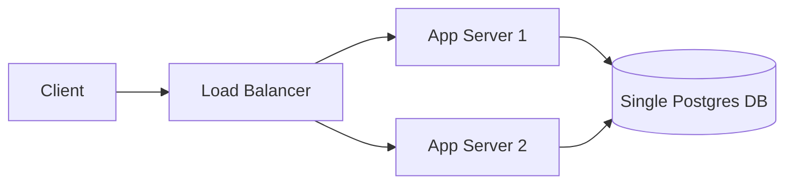
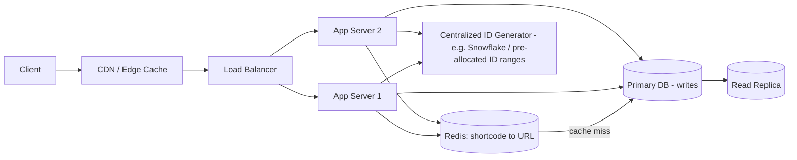
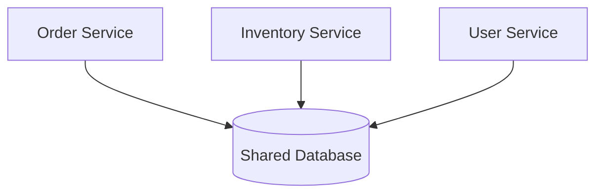
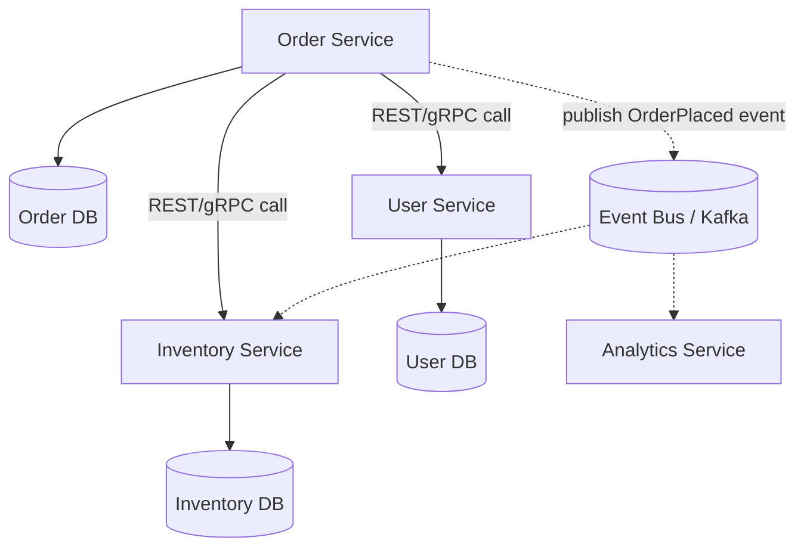

# Karat System Design: Solutions & Corrected Diagrams

Fixes for each of the four practice diagrams, with the reasoning and tradeoffs you'd say out loud in the interview.

---

## Example 1: Basic Web App — Fixed

**Original problems:** single app server, single DB, no LB, no cache, local file storage.

**Fixes applied:**
| Problem | Fix | Tradeoff |
|---|---|---|
| Single app server | Load balancer + multiple stateless app servers | More infra to manage; app must be stateless (no local session state) |
| Single DB, no redundancy | Primary + read replicas | Replication lag — reads right after a write may be stale |
| No caching | Redis in front of DB for hot reads | Cache invalidation complexity; risk of stale cache |
| Local file storage | Object storage (S3-style) shared across instances | Slight latency vs local disk; need lifecycle/versioning policy |

**What I'd say in the interview:** "I'm moving state out of the app server entirely — sessions, files, and the source of truth all live in shared, durable stores — so any app server can be killed and replaced without data loss."

---

## Example 2: Notification Service — Fixed

**Original problem:** fully synchronous chain, no retries, no isolation from slow/down third parties.

All calls shown are **synchronous** — API waits on Auth, which waits on Notif, which waits on both Email and SMS before responding.

**Fixes applied:**
| Problem | Fix | Tradeoff |
|---|---|---|
| Sync call blocks on slow provider | Notification Service just enqueues, returns immediately (202 Accepted) | Client no longer knows send status synchronously — needs polling or webhook/callback |
| No retry logic | Workers retry with exponential backoff | Adds delay before failure is surfaced; need idempotent sends downstream |
| No failure isolation | Circuit breaker per provider (not drawn but I'd mention it) so a down Email provider doesn't starve SMS workers | Added complexity, needs tuning thresholds |
| No handling of permanent failures | Dead-letter queue for exhausted retries | Requires a process/alert to review DLQ, or it becomes a silent black hole |

**What I'd say:** "The API path becomes 'validate, enqueue, respond' — under 50ms typically. The actual send happens out-of-band, so a slow SMS provider can't ever block someone's email from going out, and I get retries for free from the queue's redelivery semantics."

---

## Example 3: URL Shortener — Fixed

**Original problems:** no cache, single DB doing both reads and writes, undefined ID generation.

**Fixes applied:**
| Problem | Fix | Tradeoff |
|---|---|---|
| No cache for hot/viral reads | Redis cache + CDN edge caching for redirects | Stale redirects possible if a URL is deleted/changed (need short TTL or explicit invalidation) |
| Single DB for reads and writes | Primary for writes, replicas for reads | Eventual consistency on replica reads |
| ID generation collision risk | Centralized ID generator (Snowflake-style) or pre-allocated ID ranges per app server | Single generator can become a bottleneck/SPOF too — usually solved by making the generator itself horizontally scalable (e.g., machine-ID bits in Snowflake IDs) |

**What I'd say:** "Reads dominate writes by orders of magnitude here, so I'm optimizing the read path aggressively — CDN, then cache, then replica, only falling to the primary on a genuine cache miss on a brand-new link. For ID generation, I'd use a Snowflake-style scheme so servers can generate unique IDs independently without coordinating on every request."

---

## Example 4: Microservices with Shared DB — Fixed

**Original problem:** all three services read/write one shared database, breaking service autonomy.

**Fixes applied:**
| Problem | Fix | Tradeoff |
|---|---|---|
| Shared DB, no clear ownership | Each service owns its own DB; cross-service data accessed only via API or events | More network calls; no more cross-service SQL joins — need to duplicate/denormalize some data |
| Tight coupling via DB | Synchronous calls for calls that need an immediate answer (e.g., "is this item in stock") + async events for things that don't (e.g., "order was placed, update analytics") | Introduces the distributed-transaction problem discussed earlier — solved with saga/outbox pattern, not 2PC |
| No contract between services | Defined API contracts (REST/gRPC schemas) per service | Requires versioning discipline so one service's changes don't silently break another |

**What I'd say:** "Each service now owns its data exclusively — nobody else is allowed to touch Order DB directly. For cross-service consistency, like decrementing inventory when an order is placed, I'd use the saga pattern with compensating transactions rather than a distributed transaction, since it keeps each service independently deployable and available even if another service is down."

---

## Summary: The Pattern Across All Four Fixes

1. **Decouple** — remove single points of failure by adding redundancy (LB, replicas, multiple instances).
2. **Cache** — put a cache in front of anything read far more than it's written.
3. **Go async where synchronous isn't required** — queues, workers, retries, DLQs.
4. **Give each service/data-store a single owner** — no shared databases across service boundaries.
5. **Name the tradeoff for every fix** — interviewers care less about knowing the "right" pattern and more about hearing you reason about what you give up (consistency, latency, complexity) to get it.
